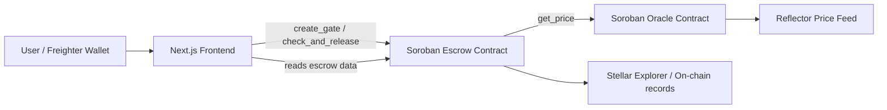
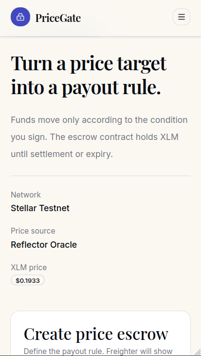
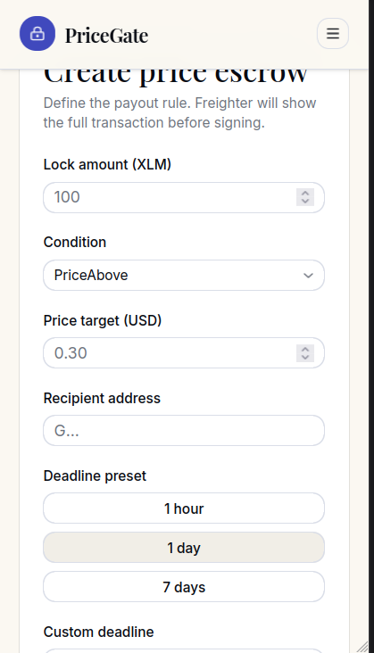
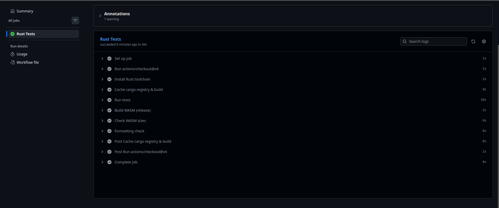
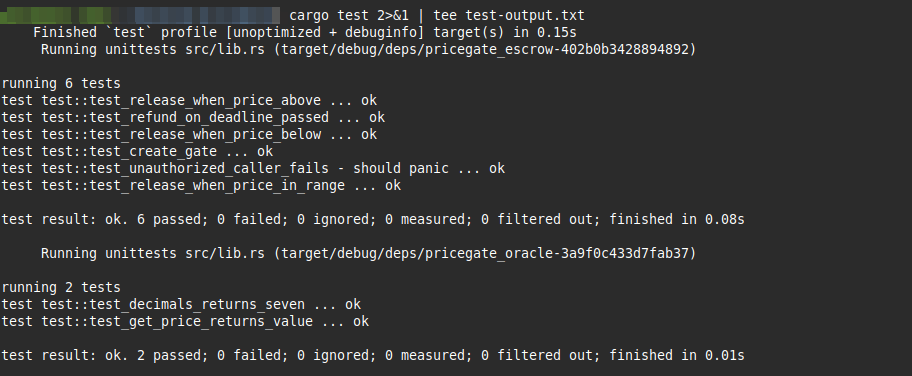

# PriceGate

[](https://github.com/Adityarust/Pricegate/actions/workflows/test.yml)

> Lock funds. Set conditions. Let the contract decide.

PriceGate is a Stellar escrow dApp that locks XLM and releases it when a price condition is met.

Live demo: https://pricegate-six.vercel.app

## Deployed Testnet Contracts

- Escrow contract: `CCSLZPGH365KUILNPFQ54HOQOSBWRL5Y5OVFP4M5S22GTDTYVCJV6TGM`
- Oracle contract: `CCS7PLDSW3KQJC5QDEMGFFMTEFPG2DDYPGQFXNQ6WURJSNPWTN466STU`
- Create gate tx: `688a743900d04512520b4e091d9884b2b682b4fd87fe00051bb8d16a0b5e7b0b`
- Release tx: `2fa08365672e57c65e8b6a9df6fbe67b1c033f9f41615fb9d4c6468ed4ca9948`

## What It Does

- Creates a non-custodial escrow on Stellar Testnet.
- Uses a live Reflector price feed for XLM/USD.
- Shows only the escrows created by the connected wallet in the UI.
- Exposes the on-chain record in Stellar Explorer for verification.

## Architecture

PriceGate is organized as three layers: a wallet-connected frontend, an oracle adapter, and an on-chain escrow contract.



How it works:

1. The user connects Freighter in the frontend and creates an escrow form.
2. The frontend submits the transaction to the Soroban escrow contract on testnet.
3. The escrow contract stores the sender, recipient, amount, deadline, and condition on chain.
4. When settlement is checked, the escrow contract calls the oracle contract.
5. The oracle contract reads the Reflector feed and normalizes the XLM price.
6. The escrow contract compares the live price against the selected rule:
   - above target
   - below target
   - inside a price range
7. If the rule is met, funds release to the recipient; otherwise they stay locked until the deadline refund path.

This keeps the business rule fully on chain while the frontend remains a thin presentation and wallet layer.

## Repository Structure

```text
contracts/   Soroban oracle and escrow contracts
frontend/    Next.js frontend
```

## Screenshot Checklist


- 


- 


## Local Setup

### Contracts

```bash
rustup target add wasm32-unknown-unknown
cargo install --locked stellar-cli
make build
make test
```

### Frontend

```bash
cd frontend
npm install
cp .env.example .env.local
npm run dev
```

## Tech Stack

- Smart contracts: Rust + Soroban SDK
- Oracle: Reflector Protocol (testnet)
- Frontend: Next.js 16, TypeScript, Tailwind CSS v4, Framer Motion
- Wallet: Freighter
- Price feed: Horizon SSE and testnet RPC reads (updates every 5s)
- CI/CD: GitHub Actions
- Hosting: Vercel
